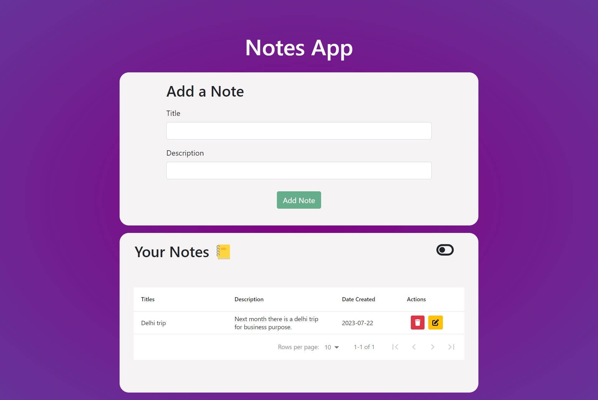

# Project Environment:

## Steps:

### Connect your mongDB Compass with localhost: 27017 for local database.

### Install node_modules for client and server(which is placed inside client folder right now) both.

### Start their servers with npm run start and nodemon index.js for client and server respectively.

### Then you can use the app and manage your tasks. Your app will be shown on `http://localhost:3000`

// Sample image

